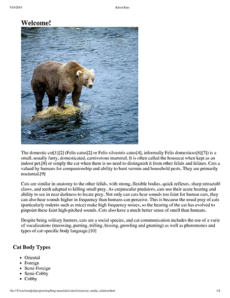
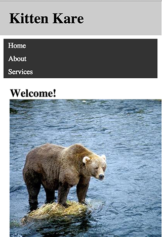

## Exercises

### Part I

Adjust the CSS to improve the view of the page.
Perform the following tasks:
1. Make the font size larger;
2. Make the font size of the h1 elements smaller;
3. Increase the spacing between the figures;
4. Add some margin on the page.
5. Save the screen width at the point where you identified that the current layout didn't work well (eg 800px). This will be the first breakpoint of the layout. A breakpoint is just a point where we are defining that the current design must change;
6. Create a media query in your CSS file, using the pixel dimension you saved as the mi.width of the media query test. Inside that breakpoint, add the following tweaks:
* Change the background color (this will help you to see when the media query took effect);
* Adjust the font size;
* Adjust the page margins;
* Exhibit the images in two columns.
7. Now, you will create another breakpoint for large screens. Resize your canvas again to find a new breakpoint.
8. Create a new media query in your CSS file using the dimension you found for large screens (for example 1300px), and make the following adjustments inside the breakpoint:
Change the background color;
* Adjust the font size;
* Adjust the page margins;
* Add the max-width property to the page, to ensure that the width of the lines is not too large.

### Part II

1. Using the mobile first approach and media queries, create three different layout versions for this page. Each layout must correspond to a different page size (small, medium and large). Make at least one commit for each layout;
2. To do this properly, you must pay attention to the content of the page and think about how to show it in each of the screen sizes:
Where should the chapter list be positioned?
* How should the story be shown?
* How should the header be positioned?
* What to do with author information on each screen size?
3. Maybe you need to change the HTML a bit, adding elements to make styling easier, or maybe moving a block inside the page.

### Part III

1 - Add a media query in the CSS file and the necessary rules for the page to look like the image below when it is printed. Specifically:
Elements with id header, navigation and footer should disappear;
The element with id aside should be shown below the main content.

2 - Add a media query in the CSS file and the necessary rules for the page to look like the images below when the screen is resized to smaller widths. Specifically:
The element with id aside should disappear;
The body element must not have padding;
Images must not exceed the width of the screen;
Items within the navigation element must each appear on their own line;
The element with id header must be fixed, so that it always appears at the top of the screen even after the user scrolls the page.

